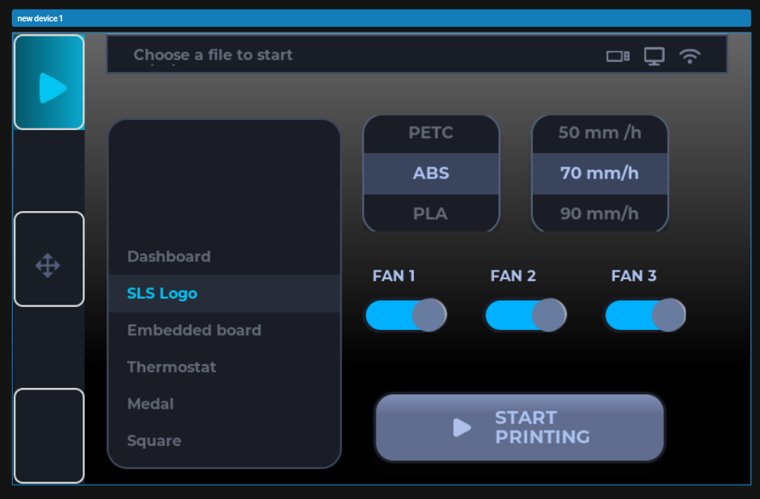

# 🚀 Smart Touch Dashboard

### ESP32-S3 • LVGL • SquareLine Vision • Embedded UI System


---

## 📱 Project Overview

**Smart Touch Dashboard** is a modern embedded UI system designed for the **ESP32-S3 CYD 5-inch (800×480)** touchscreen.

It showcases how to build a **responsive, touch-driven interface** using:

* **LVGL (Lightweight Graphics Library)**
* **SquareLine Vision v1.3.1 (UI Design Tool)**
* **PlatformIO (Professional Embedded Development)**

> 🎯 Goal: Build a scalable UI framework for real-world IoT dashboards (home automation, smart agriculture, industrial control).

---

## 🎥 Demo

👉 *(Click to watch demo)*
[https://github.com/Olawalekaybee/Smart_Touch_Dashboard_v3/assets/smart_Screen_demo.mp4](https://github.com/user-attachments/assets/cd75b95a-fd76-4482-a7a9-52acd397da38)

---

## 🖼️ Live UI Preview



---

## ✨ Key Features

* 🎨 **Pixel-perfect UI** designed in SquareLine Vision
* 👆 **Capacitive touch interaction** (smooth & responsive)
* 🔘 **3 Fan control switches** (event-driven logic)
* 📜 **Dynamic roller menu** (scroll + selection handling)
* ⚡ **Real-time LVGL event system**
* 🧱 **Modular architecture (clean & scalable)**
* 📟 **Serial debugging for system feedback**

---

## 🧠 System Architecture

```text
User Touch
    ↓
Touch Driver (esp32_smartdisplay)
    ↓
LVGL Input System
    ↓
UI Object (Button / Switch / Roller)
    ↓
Event Callback (C / C++)
    ↓
Application Logic (Fan control, UI updates)
```

---

## 🔁 Event Flow Example

```text
User toggles FAN 1 switch
        ↓
LV_EVENT_VALUE_CHANGED triggered
        ↓
FAN1_event() executes
        ↓
State checked (ON/OFF)
        ↓
Serial output / Hardware action
```

---

## 🧩 Project Structure

```bash
Smart_Touch_Dashboard_v3/
│
├── src/
│   ├── main.cpp                # Application entry point
│   └── gui/                    # SquareLine-generated UI
│       ├── screens/            # UI screens
│       ├── assets/             # Images, fonts
│       ├── behavior/           # Events & animations
│       ├── core/               # UI engine logic
│       └── helpers/            # Utility functions
│
├── assets/
│   └── screenshots/            # UI previews
│
├── platformio.ini              # Build configuration
├── README.md
└── .gitignore
```

---

## ⚙️ Getting Started

### 1. Clone the repository

```bash
git clone https://github.com/Olawalekaybee/Smart_Touch_Dashboard_v3.git
cd Smart_Touch_Dashboard_v3
```

### 2. Open in VS Code (PlatformIO)

```bash
code .
```

### 3. Build firmware

```bash
pio run
```

### 4. Upload to ESP32-S3

```bash
pio run -t upload
```

### 5. Monitor serial output

```bash
pio device monitor
```

---

## 📟 Example Output

```text
FAN 1 ON
FAN 1 OFF
Roller selected: Dashboard
Roller selected: Thermostat
```

---

## 🧠 Core Concepts

### 🔹 Event Binding (LVGL)

```cpp
lv_obj_add_event_cb(object, callback, LV_EVENT_VALUE_CHANGED, NULL);
```

### 🔹 Example

```cpp
lv_obj_add_event_cb(
    GUI_Switch__new_device_1__Toggle___Switch_2,
    FAN1_event,
    LV_EVENT_VALUE_CHANGED,
    NULL
);
```

---

## 🔌 Hardware Used

* ESP32-S3 CYD (5-inch Touch Display)
* 800×480 RGB LCD
* Capacitive Touch Panel

---

## 🛠️ Tech Stack

* **PlatformIO**
* **C++ (Arduino Framework)**
* **LVGL v9**
* **SquareLine Vision**
* **ESP32-S3**

---

## 🚀 Future Improvements

* 🌡️ Sensor integration (Temperature / Humidity)
* 🌐 WiFi connectivity + SSID display
* 🔥 Firebase real-time database integration
* ⚡ Relay control for real hardware switching
* 📊 Data visualization (charts & graphs)
* 📱 Mobile companion app (React Native)

---

## 🤝 Contributing

Contributions are welcome.

If you’d like to improve the project:

1. Fork the repo
2. Create a feature branch
3. Submit a pull request

---

## 📄 License

MIT License

---

## 👨‍💻 Author

**Olawale**

---

## ⭐ Support

If this project helped you or inspired you, consider giving it a ⭐ on GitHub.
